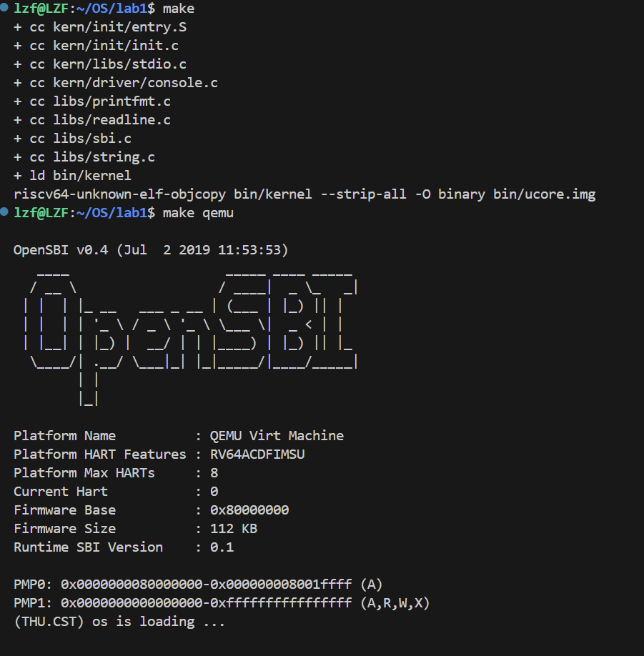
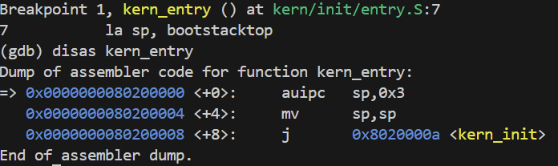
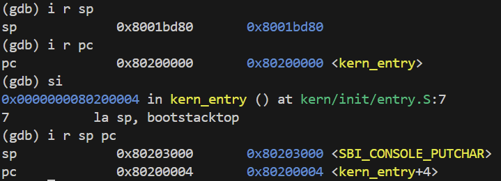
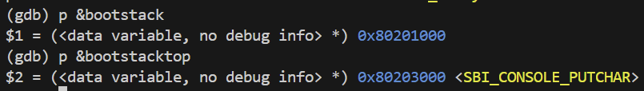
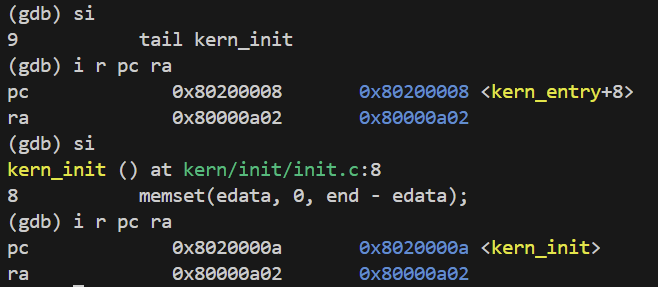
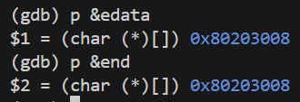
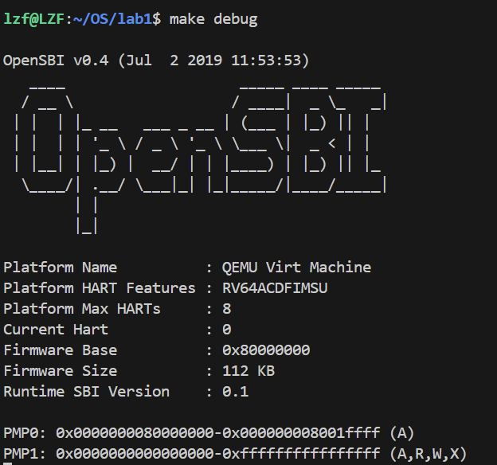

首先make一下验证我的环境是否配置好了：



## 练习1：理解内核启动中的程序入口操作

### 问题
阅读 `kern/init/entry.S` 内容代码，结合操作系统内核启动流程，说明：
1. 指令 `la sp, bootstacktop` 完成了什么操作，目的是什么？
2. `tail kern_init` 完成了什么操作，目的是什么？

### 答案

#### 1. `la sp, bootstacktop` 指令分析

**完成的操作：**
`la`（load address）是RISC-V的伪指令，将符号 `bootstacktop` 的地址加载到栈指针寄存器 `sp` 中

反汇编得到如下结果：


在实际汇编中展开为：
```assembly
# 我们写的代码：
# la sp, bootstacktop

# 汇编器看到后：
# 1. 查找 bootstacktop 的地址 = 0x80203000
# 2. 当前PC = 0x80200000
# 3. 计算差值 = 0x80203000 - 0x80200000 = 0x3000
# 4. 生成指令：auipc sp, 0x3

auipc sp, 0x3      # sp = PC + (0x3 << 12) = 0x80200000 + 0x3000 = 0x80203000
```

通过GDB验证：执行后 `sp` 的值从 `0x8001bd80` 变为 `0x80203000`


问题1：为什么不直接写 li sp, 0x80203000？ 
答：RISC-V的立即数指令有长度限制，32位地址 `0x80203000` 太大，一条指令放不下 `la` 伪指令会自动处理这个问题

**目的：**
1. **初始化内核栈**：为内核分配一个专用的栈空间

   - 栈底地址：`bootstack = 0x80201000`
   - 栈顶地址：`bootstacktop = 0x80203000`
   - 栈大小：8KB (这个也可以看entry.S的那两个引用文件，KSTACKSIZE = KSTACKPAGE * PGSIZE =4096 * 2)

2. **设置栈顶指针**：由于栈是从高地址向低地址增长，所以将 `sp` 设置为栈空间的最高地址

#### 2. `tail kern_init` 指令分析

**完成的操作：**
- `tail` 是RISC-V的尾调用优化伪指令，等价于无条件跳转
- 实际展开为 `j kern_init`(上面反汇编kern_entry最后一行就是)
- 不保存返回地址到 `ra` 寄存器，直接跳转到 `kern_init` 函数（noreturn）

**目的：**
1. **转移控制权**：将CPU执行流从汇编代码转交给C语言编写的内核初始化函数

2. **进入真正的内核初始化**：`kern_init` 函数位于 `kern/init/init.c`，负责：
   - 清空 `.bss` 段（未初始化的全局变量，在可执行文件中，.bss 段不占实际空间，编译器只记录 .bss 段的大小和位置，不会在 bin 文件中真的存储那么多 0，这就是为什么文档说：如果有个大数组，elf 文件可能只有几 KB，bin 文件却有几 MB，就是比如我int a[1024] = {0}; elf在.bss这个位置只需要记录“需要4KB的0”这个信息，但bin文件却真正有4KB的0）
   - 调用 `cprintf` 输出启动信息
   - 进入死循环

看链接脚本kernel.ld:
.text      (代码段)
.rodata    (只读数据)
.data      (已初始化数据)
.sdata     (小数据段)
├─ edata ———————— 这里是 edata 符号的位置
.bss       (未初始化数据) ← 这才是 .bss 段
├─ end ────────── 这里是 end 符号的位置



说明init.c里面没有未初始化的全局变量


3. **优化调用方式**：使用 `tail` 而不是 `call` 的原因：
   - `kern_init` 函数被标记为 `__attribute__((noreturn))`，表示永不返回
   - 不需要保存返回地址，节省了栈空间和指令开销


## 练习2：使用GDB验证启动流程

### 实验目的

使用 GDB 跟踪 QEMU 模拟的 RISC-V 从加电开始，直到执行内核第一条指令（跳转到 0x80200000）的整个过程。

---

### 调试过程

#### 1. 启动调试环境

```bash
# 终端1：启动 QEMU（等待 GDB 连接）
$ make debug

# 终端2：启动 GDB 并连接到 QEMU
$ make gdb
```

连接成功后，GDB 显示：
```
Remote debugging using localhost:1234
0x0000000000001000 in ?? ()
```

---

#### 2. 查看初始状态

**查看程序计数器（PC）**：
```bash
(gdb) i r pc
pc             0x1000   0x1000
```

**观察结果**：PC 初始值为 **0x1000**，这是 RISC-V 的**复位地址**。

**查看所有通用寄存器**：
```bash
(gdb) i r
ra             0x0      0x0
sp             0x0      0x0
...（所有寄存器都是 0x0）
pc             0x1000   0x1000
```

**观察结果**：除了 PC，其他所有寄存器都初始化为 0。

---

#### 3. 反汇编复位地址的代码

```bash
(gdb) x/10i 0x1000
=> 0x1000:      auipc   t0,0x0
   0x1004:      addi    a1,t0,32
   0x1008:      csrr    a0,mhartid
   0x100c:      ld      t0,24(t0)
   0x1010:      jr      t0
   0x1014:      unimp
   0x1016:      unimp
   0x1018:      unimp
   0x101a:      0x8000
   0x101c:      unimp
```

**观察结果**：0x1000 处有 5 条有效指令（0x1000 ~ 0x1010），后续是数据或无效指令。

---

#### 4. 逐条指令分析

##### 指令1：`auipc t0, 0x0` (0x1000)

```bash
(gdb) si
0x0000000000001004 in ?? ()

(gdb) i r pc t0
pc             0x1004   0x1004
t0             0x1000   4096
```

**功能**：将当前 PC 的值（0x1000）加载到寄存器 `t0`。  
**目的**：为后续的地址计算提供基准。

---

##### 指令2：`addi a1, t0, 32` (0x1004)

```bash
(gdb) si
0x0000000000001008 in ?? ()

(gdb) i r a1 t0 pc
a1             0x1020   4128
t0             0x1000   4096
pc             0x1008   0x1008
```

**功能**：计算 `t0 + 32 = 0x1000 + 32 = 0x1020`，存入 `a1`。  
**目的**：`a1` 可能是传递给 OpenSBI 的参数地址（数据区）。

---

##### 指令3：`csrr a0, mhartid` (0x1008)

```bash
(gdb) si
0x000000000000100c in ?? ()

(gdb) i r pc a0
pc             0x100c   0x100c
a0             0x0      0
```

**功能**：读取 CSR 寄存器 `mhartid`（硬件线程 ID）到 `a0`。  
**结果**：`a0 = 0`，表示当前是第 0 号核心（单核系统）。  
**目的**：在多核系统中区分不同的处理器核心。

---

##### 指令4：`ld t0, 24(t0)` (0x100c)

**先查看要加载的内存地址**：
```bash
(gdb) p/x $t0 + 24
$1 = 0x1018

(gdb) x/2xw 0x1018
0x1018: 0x80000000      0x00000000
```

**观察结果**：地址 0x1018 处存储的是 **0x0000000080000000**（64位值）。

**执行加载指令**：
```bash
(gdb) si
0x0000000000001010 in ?? ()

(gdb) i r t0 pc
t0             0x80000000       2147483648
pc             0x1010           0x1010
```

**功能**：从内存地址 `0x1018` 加载 64 位数据到 `t0`。  
**结果**：`t0 = 0x80000000`（OpenSBI 的入口地址）。  
**目的**：准备跳转到 OpenSBI 固件。

---

##### 指令5：`jr t0` (0x1010)

```bash
(gdb) si
0x0000000080000000 in ?? ()

(gdb) i r pc
pc             0x80000000       0x80000000
```

**功能**：无条件跳转到 `t0` 寄存器指向的地址。  
**结果**：`PC = 0x80000000`，成功跳转到 OpenSBI  
**目的**：将控制权移交给 OpenSBI 固件。

---

#### 5. 进入 OpenSBI 阶段

查看 OpenSBI 的前几条指令：
```bash
(gdb) x/10i 0x80000000
=> 0x80000000:  csrr    a6,mhartid
   0x80000004:  bgtz    a6,0x80000108
   0x80000008:  auipc   t0,0x0
   0x8000000c:  addi    t0,t0,1032
   0x80000010:  auipc   t1,0x0
   0x80000014:  addi    t1,t1,-16
   0x80000018:  sd      t1,0(t0)
   0x8000001c:  auipc   t0,0x0
   0x80000020:  addi    t0,t0,1020
   0x80000024:  ld      t0,0(t0)
```

**观察结果**：OpenSBI 的代码非常复杂，包含硬件初始化、内存配置等大量操作。

---

#### 6. 跳过 OpenSBI，到达内核入口

由于 OpenSBI 的代码有数千条指令，我们不逐条跟踪，而是在内核入口设置断点：

```bash
(gdb) b* kern_entry
Breakpoint 1 at 0x80200000: file kern/init/entry.S, line 7.
(gdb) c
Continuing.
```

**左终端显示 OpenSBI 的输出**：



**断点触发**：
```bash
Breakpoint 1, kern_entry () at kern/init/entry.S:7
7           la sp, bootstacktop

(gdb) i r pc
pc             0x80200000       0x80200000 <kern_entry>
```

成功从复位地址 0x1000 跟踪到了内核入口 0x80200000

---

### 关于 `watch *0x80200000` 的说明

#### 尝试使用 watchpoint

在调试过程中，我尝试使用 `watch *0x80200000` 来观察内核何时被加载到内存：

```bash
(gdb) monitor system_reset
(gdb) set $pc = 0x1000
(gdb) watch *0x80200000
Hardware watchpoint 2: *0x80200000

(gdb) c
Continuing.
^C    # watchpoint 一直未触发，只能手动中断
Program received signal SIGINT, Interrupt.
0x0000000080004fa0 in ?? ()
```

#### 为什么 watchpoint 没有触发？

**原因分析**：

在本实验的 QEMU 配置中，内核镜像**不是在运行时由 OpenSBI 加载的**，而是在 QEMU **启动时就直接放置在内存中**。

查看 Makefile 中的 QEMU 启动参数：
```makefile
$(QEMU) \
    -machine virt \
    -nographic \
    -bios default \
    -device loader,file=$(UCOREIMG),addr=0x80200000
            ^^^^^^^^^^^^^^^^^^^^^^^^^^^^^^^^^^^^^^
            这个参数在 QEMU 启动时就把内核加载到 0x80200000
```

**实际的加载时机**：
```
QEMU 启动阶段（执行任何指令之前）：
  ├─ 加载 OpenSBI 固件 → 物理地址 0x80000000
  ├─ 加载内核镜像 → 物理地址 0x80200000  ← 已经在内存里了！
  └─ 设置 PC = 0x1000（复位地址）

然后开始执行：
  0x1000 (ROM) → 0x80000000 (OpenSBI) → 0x80200000 (内核)
```

由于内核在 `system_reset` 后就已经在内存中，不会再有**写入操作**，因此 `watch` 不会触发。

#### 验证内核已在内存中

可以在复位后直接查看 0x80200000 的内容：
```bash
(gdb) monitor system_reset
(gdb) set $pc = 0x1000
(gdb) x/10i 0x80200000
0x80200000:  auipc  sp, 0x3       # 已经是kern_entry的代码了
0x80200004:  mv     sp, sp
0x80200008:  j      0x8020000a
```

**结论**：这是为了简化实验环境而采用的设计。在真实系统中，Bootloader 需要从硬盘读取内核，但那需要实现复杂的文件系统和驱动程序。

---

### 问题回答

#### 问题1：RISC-V 硬件加电后最初执行的几条指令位于什么地址？

**答案**：**0x1000**（复位地址）

---

#### 问题2：它们主要完成了哪些功能？

**答案**：

位于 0x1000 ~ 0x1010 的 5 条指令完成以下功能：

| 地址   | 指令                | 功能描述 |
|--------|---------------------|----------|
| 0x1000 | `auipc t0, 0x0`     | 将当前 PC 值（0x1000）加载到 t0 |
| 0x1004 | `addi a1, t0, 32`   | 计算参数地址（0x1020）存入 a1 |
| 0x1008 | `csrr a0, mhartid`  | 读取当前硬件线程 ID 到 a0（值为 0） |
| 0x100c | `ld t0, 24(t0)`     | 从地址 0x1018 加载跳转目标（0x80000000）到 t0 |
| 0x1010 | `jr t0`             | 跳转到 t0（OpenSBI 入口） |

**主要功能总结**：

1. **准备环境参数**
   - 获取当前地址作为基准
   - 计算数据区域地址

2. **获取硬件信息**
   - 读取处理器核心 ID（用于多核系统）

3. **加载并跳转到 Bootloader**
   - 从固定位置（0x1018）读取 OpenSBI 入口地址（0x80000000）
   - 无条件跳转，移交控制权

**设计意图**：

这段代码是固化在 ROM 中的**最小启动引导代码**，其唯一目的是**快速将控制权转交给功能更强大的 OpenSBI 固件**。OpenSBI 再负责完整的硬件初始化和操作系统加载。

---

### 完整启动流程图
```
阶段1: ROM固件（MROM）
地址: 0x1000
功能: 最基础的硬件初始化，跳转到OpenSBI
    ↓
阶段2: OpenSBI固件
地址: 0x80000000
功能: M模式初始化，加载内核到 0x80200000
    ↓
阶段3: 内核入口（entry.S）
地址: 0x80200000 (kern_entry)
功能: 设置内核栈，跳转到C语言入口
    ↓
阶段4: C语言入口（init.c）
地址: 0x8020000a (kern_init)
功能: 清空.bss段，输出信息，进入死循环
```

---


### 实验中的新认知

1. OS启动时是"一无所有"的，连栈都需要自己创建
2. 没有固件，内核无法启动（无法"自举"）
3. GDB让我们能"看见"CPU的每一步执行
4. SBI、BIOS/UEFI都是硬件抽象层的实现