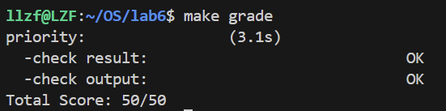
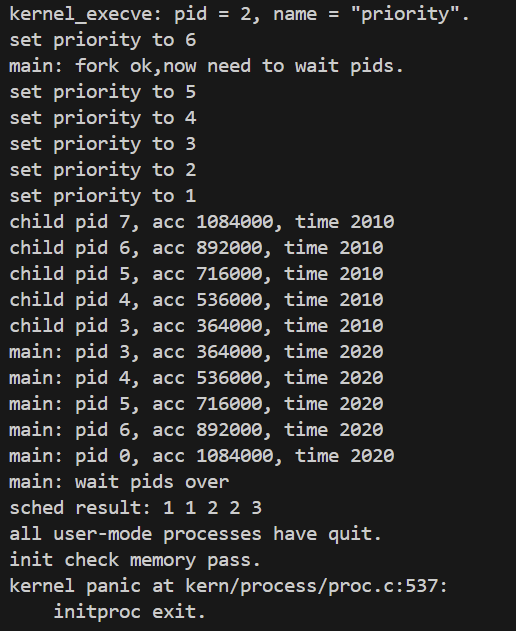

# Lab6 实验报告：进程调度


## 练习0：填写已有实验

本实验依赖实验2/3/4/5，需要将之前实验的代码填入相应位置。主要修改的文件和内容如下：

### 1. `alloc_proc` 函数（kern/process/proc.c）

**函数用途**：`alloc_proc` 用于分配一个新的进程控制块（PCB），并对其所有字段进行初始化。这是创建新进程的第一步。

**概要设计思路**：在Lab6中，进程控制块新增了与调度相关的成员变量（运行队列指针、时间片、stride值、优先级等），需要在进程初始化时将这些字段设置为合理的初始值，以便后续调度算法能够正确工作。

```c
static struct proc_struct *
alloc_proc(void)
{
    // kmalloc: 内核内存分配函数，用于动态分配指定大小的内存
    struct proc_struct *proc = kmalloc(sizeof(struct proc_struct));
    if (proc != NULL)
    {
        // ============ LAB4 初始化部分 ============
        proc->state = PROC_UNINIT;      // 进程状态设为未初始化
        proc->pid = -1;                  // 进程ID设为-1，表示尚未分配
        proc->runs = 0;                  // 进程运行次数初始化为0
        proc->kstack = 0;                // 内核栈地址初始化为0
        proc->need_resched = 0;          // 不需要调度标志初始化为0
        proc->parent = NULL;             // 父进程指针初始化为空
        proc->mm = NULL;                 // 内存管理结构初始化为空
        proc->tf = NULL;                 // 中断帧指针初始化为空
        proc->pgdir = boot_pgdir_pa;     // 页目录表基址设为内核页目录表
        proc->flags = 0;                 // 进程标志位初始化为0
        // memset: 将指定内存区域设置为特定值（这里是0）
        memset(&(proc->context), 0, sizeof(struct context));  // 上下文清零
        memset(proc->name, 0, PROC_NAME_LEN);                 // 进程名清零

        // ============ LAB5 初始化部分 ============
        proc->wait_state = 0;                        // 等待状态初始化为0
        proc->cptr = proc->optr = proc->yptr = NULL; // 进程关系指针全部置空

        // ============ LAB6 初始化部分 2311474 ============
        proc->rq = NULL;                 // 所属运行队列指针初始化为空
        // list_init: 初始化链表节点，使其prev和next都指向自己
        list_init(&(proc->run_link));    // 初始化运行队列链表项
        proc->time_slice = 0;            // 时间片初始化为0
        // 初始化斜堆节点的三个指针（左子树、右子树、父节点）为空
        proc->lab6_run_pool.left = proc->lab6_run_pool.right = proc->lab6_run_pool.parent = NULL;
        proc->lab6_stride = 0;           // stride值初始化为0
        proc->lab6_priority = 0;         // 优先级初始化为0
    }
    return proc;                         // 返回分配的进程控制块指针
}
```

### 2. 时钟中断处理（kern/trap/trap.c）

**函数用途**：`interrupt_handler` 中的时钟中断处理部分负责在每次时钟中断时更新系统tick计数，并调用调度器的tick处理函数来更新当前进程的时间片。

**概要设计思路**：Lab6需要支持时间片轮转调度，因此在时钟中断时需要调用 `sched_class_proc_tick` 来减少当前进程的时间片。当时间片用尽时，会设置 `need_resched` 标志，触发进程调度。

```c
case IRQ_S_TIMER:
    // clock_set_next_event: 设置下一次时钟中断的触发时间
    // 这个函数会向SBI发送请求，设置下一次timer中断
    clock_set_next_event();
    
    // ticks: 全局变量，记录系统启动以来的时钟中断次数
    ticks++;

    // LAB6: 2311474
    // sched_class_proc_tick: 调度框架提供的接口函数
    // 用途: 通知调度器当前进程又运行了一个时钟周期
    // 内部会调用具体调度算法的proc_tick函数来处理时间片
    // current: 指向当前正在运行的进程的全局指针
    sched_class_proc_tick(current);
    
    break;
```

---

## 练习1：理解调度器框架的实现

### 1. sched_class 结构体分析

**结构体用途**：`sched_class` 是调度类的抽象接口，定义了一个调度算法必须实现的所有操作。通过函数指针实现了策略与机制的分离。

```c
struct sched_class {
    const char *name;  // 调度类的名字，用于标识和打印

    // init: 初始化运行队列
    // 调用时机: sched_init()中，系统启动时调用一次
    void (*init)(struct run_queue *rq);

    // enqueue: 将进程加入运行队列
    // 调用时机: 进程变为就绪态时（wakeup_proc）、当前进程需要重新排队时（schedule）
    void (*enqueue)(struct run_queue *rq, struct proc_struct *proc);

    // dequeue: 将进程从运行队列移除
    // 调用时机: schedule()选中进程后将其从队列移除
    void (*dequeue)(struct run_queue *rq, struct proc_struct *proc);

    // pick_next: 选择下一个要运行的进程
    // 调用时机: schedule()中选择调度目标
    struct proc_struct *(*pick_next)(struct run_queue *rq);

    // proc_tick: 处理时钟中断，更新进程时间片
    // 调用时机: 每次时钟中断时调用
    void (*proc_tick)(struct run_queue *rq, struct proc_struct *proc);
};
```

**为什么使用函数指针而不是直接实现：**
使用函数指针实现了**策略与机制分离**的设计模式，这是C语言下模拟面向对象编程的方法。好处包括：
- **可扩展性**：添加新调度算法只需实现接口，无需修改框架代码
- **可替换性**：运行时可以切换不同的调度算法
- **解耦合**：调度框架不依赖具体算法实现

### 2. run_queue 结构体分析

**结构体用途**：`run_queue` 用于组织所有处于就绪状态的进程，是调度器进行进程选择的数据来源。

```c
struct run_queue {
    list_entry_t run_list;           // 双向循环链表头，用于RR调度
    unsigned int proc_num;           // 队列中的进程数量
    int max_time_slice;              // 最大时间片，进程入队时会重置为此值
    skew_heap_entry_t *lab6_run_pool; // 斜堆根节点指针，用于Stride调度
};
```

**Lab5 vs Lab6 的差异：**
Lab5中没有专门的 `run_queue` 结构，调度直接遍历 `proc_list`。Lab6新增了 `lab6_run_pool` 支持斜堆。

**为什么需要支持两种数据结构（链表和斜堆）：**
- **链表**：适用于RR调度算法，FIFO特性，入队出队 O(1)
- **斜堆**：适用于Stride调度算法，优先队列特性，可以 O(log n) 获取最小stride进程

### 3. 调度器框架核心函数

#### sched_init 函数

**函数用途**：初始化调度器，将具体的调度算法与调度框架绑定，并初始化运行队列。

```c
void sched_init(void)
{
    // list_init: 初始化定时器链表（用于sleep等功能）
    list_init(&timer_list);
    
    // 关键步骤：绑定调度算法
    // 将全局调度类指针指向具体的调度算法实现
    sched_class = &default_sched_class;  // 使用RR调度器
    // sched_class = &stride_sched_class; // 或使用Stride调度器

    // rq: 全局运行队列指针
    // __rq: 静态分配的运行队列结构体
    rq = &__rq;
    
    // MAX_TIME_SLICE: 最大时间片常量，定义在sched.h中，值为5
    rq->max_time_slice = MAX_TIME_SLICE;
    
    // 调用具体调度算法的初始化函数
    // 通过函数指针调用，实现了多态
    sched_class->init(rq);

    // cprintf: 内核打印函数，输出调度器名称
    cprintf("sched class: %s\n", sched_class->name);
}
```

#### wakeup_proc 函数

**函数用途**：唤醒一个进程，将其状态设为就绪态，并加入运行队列等待调度。

```c
void wakeup_proc(struct proc_struct *proc)
{
    // assert: 断言检查，确保不会唤醒僵尸进程
    assert(proc->state != PROC_ZOMBIE);
    
    bool intr_flag;
    // local_intr_save: 保存中断状态并关闭中断，防止并发问题
    local_intr_save(intr_flag);
    {
        // 只有非RUNNABLE状态的进程才需要唤醒
        if (proc->state != PROC_RUNNABLE)
        {
            proc->state = PROC_RUNNABLE;  // 设置为就绪态
            proc->wait_state = 0;          // 清除等待状态
            
            // 如果不是当前进程，则加入运行队列
            // 当前进程不需要入队，因为它正在运行
            if (proc != current)
            {
                // sched_class_enqueue: 调度框架的入队封装函数
                sched_class_enqueue(proc);
            }
        }
        else
        {
            // warn: 警告输出，提示试图唤醒已经就绪的进程
            warn("wakeup runnable process.\n");
        }
    }
    // local_intr_restore: 恢复之前的中断状态
    local_intr_restore(intr_flag);
}
```

#### schedule 函数

**函数用途**：核心调度函数，负责选择下一个要运行的进程并进行上下文切换。

```c
void schedule(void)
{
    bool intr_flag;
    struct proc_struct *next;
    
    // 关闭中断，保证调度过程的原子性
    local_intr_save(intr_flag);
    {
        // 清除当前进程的调度请求标志
        current->need_resched = 0;
        
        // 如果当前进程仍然是就绪态（只是时间片用完），则重新入队
        if (current->state == PROC_RUNNABLE)
        {
            sched_class_enqueue(current);
        }
        
        // 从运行队列中选择下一个要执行的进程
        // sched_class_pick_next: 调度框架的选择封装函数
        if ((next = sched_class_pick_next()) != NULL)
        {
            // 选中的进程从队列中移除
            sched_class_dequeue(next);
        }
        
        // 如果没有就绪进程，则运行idle进程
        // idleproc: 空闲进程，当没有其他进程可运行时执行
        if (next == NULL)
        {
            next = idleproc;
        }
        
        // 增加被选中进程的运行次数计数
        next->runs++;
        
        // 如果选中的不是当前进程，则进行上下文切换
        if (next != current)
        {
            // proc_run: 执行进程切换，切换页表和上下文
            proc_run(next);
        }
    }
    local_intr_restore(intr_flag);
}
```

### 4. 进程调度流程图

```
时钟中断触发 (IRQ_S_TIMER)
    ↓
interrupt_handler()
    ├── clock_set_next_event()     // 设置下次时钟中断
    ├── ticks++                     // 增加全局tick计数
    └── sched_class_proc_tick(current)  // 调用调度器tick处理
              ↓
         proc_tick()              // 具体算法的tick处理
              ├── proc->time_slice--    // 时间片减1
              └── if (time_slice == 0)
                     proc->need_resched = 1  // 设置调度标志
    ↓
trap返回前检查
    ↓
if (current->need_resched)
    └── schedule()
           ├── current->need_resched = 0    // 清除标志
           ├── sched_class_enqueue(current) // 当前进程入队
           ├── next = sched_class_pick_next() // 选择下一个
           ├── sched_class_dequeue(next)    // 出队
           └── proc_run(next)               // 切换进程
```

**need_resched 标志位的作用：**
- 标记当前进程是否需要被调度
- 由 `proc_tick` 在时间片用尽时设置
- 在中断返回前检查，触发 `schedule()`
- 实现了抢占式调度的关键机制

### 5. 调度算法切换机制

要添加新调度算法（如Stride），只需：

1. 实现调度类接口的5个函数
2. 定义调度类结构体
3. 修改 `sched_init()` 中的一行代码：`sched_class = &stride_sched_class;`

**设计优势**：只需修改一行代码即可切换调度算法，框架代码无需改动。

---

## 练习2：实现 Round Robin 调度算法

### 1. Lab5 与 Lab6 函数对比

以 `schedule()` 函数为例：

**Lab5 实现（FIFO）：**
```c
void schedule(void) {
    // 直接遍历proc_list查找RUNNABLE进程
    last = (current == idleproc) ? &proc_list : &(current->list_link);
    do {
        if ((le = list_next(le)) != &proc_list) {
            next = le2proc(le, list_link);
            if (next->state == PROC_RUNNABLE) break;
        }
    } while (le != last);
}
```

**Lab6 实现（使用调度框架）：**
```c
void schedule(void) {
    if (current->state == PROC_RUNNABLE) {
        sched_class_enqueue(current);    // 通过框架接口入队
    }
    next = sched_class_pick_next();      // 通过框架接口选择
    if (next != NULL) {
        sched_class_dequeue(next);       // 通过框架接口出队
    }
}
```

**为什么要做这个改动：**
- Lab5的实现将调度算法与框架耦合，无法灵活切换算法
- Lab6通过抽象接口解耦，支持多种调度算法
- 不做改动将无法使用RR、Stride等高级调度算法

### 2. RR调度算法实现

#### RR_init 函数

**函数用途**：初始化RR调度器的运行队列，将链表设为空，进程计数设为0。

**概要设计思路**：RR调度使用双向循环链表作为就绪队列，初始化时需要将链表头节点初始化为空链表状态（prev和next都指向自己）。

```c
static void
RR_init(struct run_queue *rq)
{
    // LAB6: 2311474
    
    // list_init: libs/list.h中定义的链表初始化函数
    // 用途: 将链表节点的prev和next指针都指向自己，形成空的循环链表
    // 参数: &(rq->run_list) - 运行队列的链表头指针
    list_init(&(rq->run_list));
    
    // 初始化进程计数为0，表示队列中没有进程
    rq->proc_num = 0;
}
```

#### RR_enqueue 函数

**函数用途**：将一个进程加入到RR调度器的运行队列尾部，并初始化其时间片。

**概要设计思路**：
1. RR是FIFO式调度，新进程应该加到队列尾部
2. 使用 `list_add_before(&head, &node)` 可以将节点插入到head之前，对于循环链表来说就是队列尾部
3. 如果进程时间片为0（刚用完）或异常值，需要重置为最大时间片
4. 更新进程的运行队列指针和队列计数

```c
static void
RR_enqueue(struct run_queue *rq, struct proc_struct *proc)
{
    // LAB6: 2311474
    
    // assert: 断言检查，确保进程不在任何队列中（run_link应该是空的）
    // list_empty: 检查链表节点是否为空（prev和next都指向自己）
    // 用途: 防止同一个进程被重复入队
    assert(list_empty(&(proc->run_link)));
    
    // list_add_before: libs/list.h中定义的链表插入函数
    // 用途: 将第二个参数指向的节点插入到第一个参数指向的节点之前
    // 原理: 对于循环双向链表，头节点之前就是尾部
    // 效果: 实现FIFO队列的入队操作
    list_add_before(&(rq->run_list), &(proc->run_link));
    
    // 时间片处理：
    // 如果时间片为0（刚用完被调度出去）或者大于最大值（异常情况）
    // 则重置为最大时间片，给进程一个完整的运行周期
    if (proc->time_slice == 0 || proc->time_slice > rq->max_time_slice) {
        proc->time_slice = rq->max_time_slice;
    }
    
    // 设置进程所属的运行队列指针，用于后续检查和操作
    proc->rq = rq;
    
    // 增加运行队列的进程计数
    rq->proc_num++;
}
```

#### RR_dequeue 函数

**函数用途**：将一个进程从RR调度器的运行队列中移除。

**概要设计思路**：
1. 首先检查进程确实在队列中
2. 使用 `list_del_init` 将进程从链表中删除并重新初始化其链表节点
3. 更新队列计数

```c
static void
RR_dequeue(struct run_queue *rq, struct proc_struct *proc)
{
    // LAB6: 2311474
    
    // assert: 断言检查，确保：
    // 1. 进程的run_link不为空（确实在某个队列中）
    // 2. 进程所属的运行队列就是当前队列rq
    // !list_empty: 检查链表节点是否非空
    assert(!list_empty(&(proc->run_link)) && proc->rq == rq);
    
    // list_del_init: libs/list.h中定义的链表删除函数
    // 用途: 将节点从链表中删除，并将该节点重新初始化为空节点
    // 原理: 1. 修改前驱和后继节点的指针，跳过当前节点
    //       2. 将当前节点的prev和next都指向自己
    // 好处: 删除后节点处于干净状态，可以安全地再次入队
    list_del_init(&(proc->run_link));
    
    // 减少运行队列的进程计数
    rq->proc_num--;
}
```

#### RR_pick_next 函数

**函数用途**：从RR调度器的运行队列中选择下一个要运行的进程（队首进程）。

**概要设计思路**：
1. RR调度总是选择队首进程（最早入队的进程）
2. 使用 `list_next` 获取链表头的下一个节点（即队首）
3. 使用 `le2proc` 宏从链表节点获取进程控制块指针
4. 处理空队列的边界情况

```c
static struct proc_struct *
RR_pick_next(struct run_queue *rq)
{
    // LAB6: 2311474
    
    // list_next: libs/list.h中定义的获取下一个节点的宏
    // 用途: 获取链表中指定节点的后继节点
    // 原理: 返回 elm->next
    // 这里获取run_list头节点的下一个节点，即队首元素
    list_entry_t *le = list_next(&(rq->run_list));
    
    // 边界条件检查：判断队列是否为空
    // 如果le等于链表头，说明链表为空（只有头节点，没有实际元素）
    if (le != &(rq->run_list)) {
        // le2proc: kern/process/proc.h中定义的宏
        // 用途: 从链表节点指针获取包含该节点的进程控制块指针
        // 原理: 使用container_of/to_struct技术
        //       已知结构体成员地址，计算结构体起始地址
        // 参数: le - 链表节点指针
        //       run_link - 链表节点在proc_struct中的成员名
        return le2proc(le, run_link);
    }
    
    // 队列为空，返回NULL
    return NULL;
}
```

#### RR_proc_tick 函数

**函数用途**：处理时钟中断，减少当前运行进程的时间片，时间片用尽时设置调度标志。

**概要设计思路**：
1. 每次时钟中断时减少当前进程的时间片
2. 当时间片减为0时，设置 `need_resched` 标志
3. 该标志会在中断返回前被检查，触发 `schedule()` 进行进程切换

```c
static void
RR_proc_tick(struct run_queue *rq, struct proc_struct *proc)
{
    // LAB6: 2311474
    
    // 首先检查时间片是否大于0
    // 防止时间片变成负数（虽然理论上不应该发生）
    if (proc->time_slice > 0) {
        // 时间片减1，表示进程又运行了一个时钟周期
        proc->time_slice--;
    }
    
    // 检查时间片是否用尽
    if (proc->time_slice == 0) {
        // need_resched: 进程控制块中的调度标志
        // 用途: 标记该进程需要被调度（让出CPU）
        // 设为1后，在trap返回前会检查此标志并调用schedule()
        // 这是实现抢占式调度的关键机制
        proc->need_resched = 1;
    }
}
```

### 3. make grade 输出结果



### 4. RR调度算法优缺点分析

**优点：**
- 实现简单，易于理解
- 公平性好，每个进程获得相等的CPU时间
- 响应时间可预测（最长等待时间 = (n-1) × 时间片）

**缺点：**
- 不考虑进程优先级
- 时间片设置需要权衡
- 对I/O密集型进程不友好

**为什么需要在 RR_proc_tick 中设置 need_resched 标志：**
时钟中断只是减少时间片，不能直接在中断处理中调度。设置标志后，在trap返回前检查该标志，在安全的时机进行调度，避免在中断处理中进行复杂的上下文切换。

### 5. 拓展思考

**优先级RR调度的修改：**
1. 使用多个运行队列，每个优先级一个
2. `pick_next` 从最高优先级非空队列选择

**多核调度支持：**
当前不支持。需要每个CPU一个运行队列、添加自旋锁、实现负载均衡。

---

## 练习3：实现 Stride Scheduling 调度算法

### 1. BIG_STRIDE 常量定义

**概要设计思路**：
stride使用32位无符号整数，比较时需要处理溢出问题。通过将stride差值转换为有符号整数比较，可以正确处理溢出。为保证 `STRIDE_MAX - STRIDE_MIN` 在有符号32位整数范围内，`BIG_STRIDE` 应取 `0x7FFFFFFF`（32位有符号整数最大值）。

```c
/* LAB6 2311474 */
/* BIG_STRIDE的选择原理：
 * 1. stride值会不断增加，可能溢出32位无符号整数
 * 2. 比较两个stride时，使用有符号减法：(int32_t)(a - b)
 * 3. 为保证比较正确，需要 STRIDE_MAX - STRIDE_MIN <= 0x7FFFFFFF
 * 4. 由于 STRIDE_MAX - STRIDE_MIN <= PASS_MAX = BIG_STRIDE / priority
 * 5. 当 priority >= 1 时，差值最大为 BIG_STRIDE
 * 6. 因此 BIG_STRIDE 应取 0x7FFFFFFF
 */
#define BIG_STRIDE 0x7FFFFFFF
```

### 2. proc_stride_comp_f 比较函数

**函数用途**：斜堆的比较函数，用于比较两个进程的stride值大小，决定在斜堆中的位置。

```c
static int
proc_stride_comp_f(void *a, void *b)
{
     // le2proc: 从斜堆节点指针获取进程控制块指针
     // lab6_run_pool: 进程控制块中的斜堆节点成员名
     struct proc_struct *p = le2proc(a, lab6_run_pool);
     struct proc_struct *q = le2proc(b, lab6_run_pool);
     
     // 关键：使用有符号整数计算差值
     // 这样即使发生溢出，只要差值在int32范围内，比较结果仍然正确
     // 例如：无符号 98 - 65535 = 99 (溢出)
     //       有符号 (int32_t)(98 - 65535) = 99 > 0
     //       说明在逻辑上 98 > 65535（因为65535溢出了）
     int32_t c = p->lab6_stride - q->lab6_stride;
     
     // 返回比较结果：1表示a>b，0表示相等，-1表示a<b
     if (c > 0)
          return 1;
     else if (c == 0)
          return 0;
     else
          return -1;
}
```

### 3. stride_init 函数

**函数用途**：初始化Stride调度器的运行队列，包括链表和斜堆。

**概要设计思路**：Stride调度使用斜堆作为优先队列，需要初始化斜堆根指针为NULL。同时保留链表初始化以支持链表实现的备选方案。

```c
static void
stride_init(struct run_queue *rq)
{
     /* LAB6 2311474 */
     
     // list_init: 初始化链表（备选实现或其他用途）
     // 即使使用斜堆，也初始化链表以保持一致性
     list_init(&(rq->run_list));
     
     // lab6_run_pool: 斜堆的根节点指针
     // 初始化为NULL表示空堆
     // 斜堆是一种自平衡的堆结构，不需要额外的初始化
     rq->lab6_run_pool = NULL;
     
     // 进程计数初始化为0
     rq->proc_num = 0;
}
```

### 4. stride_enqueue 函数

**函数用途**：将进程加入Stride调度器的运行队列（斜堆）。

**概要设计思路**：
1. 使用 `skew_heap_insert` 将进程的斜堆节点插入到优先队列中
2. 斜堆会自动根据比较函数维护堆的性质（最小stride在堆顶）
3. 同样需要处理时间片的初始化

```c
static void
stride_enqueue(struct run_queue *rq, struct proc_struct *proc)
{
     /* LAB6 2311474 */
     
#if USE_SKEW_HEAP
     // skew_heap_insert: libs/skew_heap.h中定义的斜堆插入函数
     // 用途: 将一个节点插入到斜堆中，并返回新的堆根
     // 参数1: rq->lab6_run_pool - 当前堆的根节点
     // 参数2: &(proc->lab6_run_pool) - 要插入的节点
     // 参数3: proc_stride_comp_f - 比较函数
     // 原理: 斜堆合并操作，时间复杂度O(log n)摊还
     // 返回值: 插入后新的堆根（可能改变）
     rq->lab6_run_pool = skew_heap_insert(rq->lab6_run_pool, 
                                          &(proc->lab6_run_pool), 
                                          proc_stride_comp_f);
#else
     // 备选实现：使用链表
     list_add_before(&(rq->run_list), &(proc->run_link));
#endif

     // 时间片处理（与RR相同）
     // 如果时间片为0或超过最大值，重置为最大时间片
     if (proc->time_slice == 0 || proc->time_slice > rq->max_time_slice) {
          proc->time_slice = rq->max_time_slice;
     }
     
     // 设置进程所属的运行队列
     proc->rq = rq;
     
     // 增加进程计数
     rq->proc_num++;
}
```

### 5. stride_dequeue 函数

**函数用途**：将进程从Stride调度器的运行队列（斜堆）中移除。

**概要设计思路**：使用 `skew_heap_remove` 从斜堆中删除指定节点。斜堆支持O(log n)的任意节点删除。

```c
static void
stride_dequeue(struct run_queue *rq, struct proc_struct *proc)
{
     /* LAB6 2311474 */
     
#if USE_SKEW_HEAP
     // skew_heap_remove: libs/skew_heap.h中定义的斜堆删除函数
     // 用途: 从斜堆中删除指定节点，并返回新的堆根
     // 参数1: rq->lab6_run_pool - 当前堆的根节点
     // 参数2: &(proc->lab6_run_pool) - 要删除的节点
     // 参数3: proc_stride_comp_f - 比较函数
     // 原理: 删除节点后合并其左右子树
     // 返回值: 删除后新的堆根（可能改变）
     rq->lab6_run_pool = skew_heap_remove(rq->lab6_run_pool, 
                                          &(proc->lab6_run_pool), 
                                          proc_stride_comp_f);
#else
     // 备选实现：使用链表
     assert(!list_empty(&(proc->run_link)) && proc->rq == rq);
     list_del_init(&(proc->run_link));
#endif

     // 减少进程计数
     rq->proc_num--;
}
```

### 6. stride_pick_next 函数

**函数用途**：从Stride调度器的运行队列中选择stride值最小的进程，并更新其stride值。

**概要设计思路**：
1. 斜堆的根节点就是stride最小的进程
2. 使用 `le2proc` 从斜堆节点获取进程控制块
3. 选中进程后，更新其stride值：`stride += BIG_STRIDE / priority`
4. 处理优先级为0的边界情况

```c
static struct proc_struct *
stride_pick_next(struct run_queue *rq)
{
     /* LAB6 2311474 */
     
#if USE_SKEW_HEAP
     // 检查斜堆是否为空
     if (rq->lab6_run_pool == NULL) {
          return NULL;
     }
     
     // 斜堆的性质：根节点就是最小元素
     // 直接从根节点获取stride最小的进程
     // le2proc: 从斜堆节点指针获取进程控制块指针
     // lab6_run_pool: 斜堆节点在proc_struct中的成员名
     struct proc_struct *p = le2proc(rq->lab6_run_pool, lab6_run_pool);
#else
     // 备选实现：链表需要遍历找最小
     list_entry_t *le = list_next(&(rq->run_list));
     if (le == &(rq->run_list)) {
          return NULL;
     }
     
     // 遍历链表找stride最小的进程
     struct proc_struct *p = le2proc(le, run_link);
     le = list_next(le);
     while (le != &(rq->run_list)) {
          struct proc_struct *q = le2proc(le, run_link);
          // 使用有符号比较处理溢出
          if ((int32_t)(q->lab6_stride - p->lab6_stride) < 0) {
               p = q;
          }
          le = list_next(le);
     }
#endif

     // 更新被选中进程的stride值
     // 公式: stride += pass = BIG_STRIDE / priority
     // 边界处理: 如果优先级为0，则步长为BIG_STRIDE（最大步长）
     if (p->lab6_priority == 0) {
          // 优先级为0时，给最大步长，相当于最低优先级
          p->lab6_stride += BIG_STRIDE;
     } else {
          // 正常情况：步长与优先级成反比
          // 优先级越高，步长越小，增长越慢，更容易被再次选中
          p->lab6_stride += BIG_STRIDE / p->lab6_priority;
     }
     
     return p;
}
```

### 7. stride_proc_tick 函数

**函数用途**：处理时钟中断，与RR调度相同，减少时间片并在用尽时设置调度标志。

**概要设计思路**：Stride调度同样使用时间片控制单次运行时间，tick处理逻辑与RR完全相同。

```c
static void
stride_proc_tick(struct run_queue *rq, struct proc_struct *proc)
{
     /* LAB6 2311474 */
     
     // 如果时间片大于0，减少时间片
     if (proc->time_slice > 0) {
          proc->time_slice--;
     }
     
     // 如果时间片用尽，设置调度标志
     if (proc->time_slice == 0) {
          proc->need_resched = 1;
     }
}
```

### 8. Stride算法正比性证明

**定理**：经过足够长时间后，每个进程分配的时间片数目与其优先级成正比。

**证明思路**：

设进程 P 的优先级为 $priority_P$，步长为：
$$pass_P = \frac{BIG\_STRIDE}{priority_P}$$

假设在时间 T 内，进程 P 被调度了 $n_P$ 次，则其stride增量为：
$$\Delta stride_P = n_P \times pass_P = n_P \times \frac{BIG\_STRIDE}{priority_P}$$

由于Stride调度总是选择stride最小的进程，经过足够长时间后，所有进程的stride趋于相等：
$$\Delta stride_P \approx \Delta stride_Q$$

即：
$$n_P \times \frac{BIG\_STRIDE}{priority_P} \approx n_Q \times \frac{BIG\_STRIDE}{priority_Q}$$

化简得：
$$\frac{n_P}{n_Q} \approx \frac{priority_P}{priority_Q}$$

因此，调度次数（时间片数目）与优先级成正比。

### 9. 多级反馈队列调度算法设计

**概要设计：**

```c
// 数据结构定义
#define MLFQ_LEVELS 4  // 4个优先级队列

struct mlfq_run_queue {
    list_entry_t queues[MLFQ_LEVELS];  // N个队列
    int timeslice[MLFQ_LEVELS];        // 各队列时间片: 1, 2, 4, 8
    int proc_num;
};

// 核心函数
void mlfq_init(struct mlfq_run_queue *rq) {
    for (int i = 0; i < MLFQ_LEVELS; i++) {
        list_init(&rq->queues[i]);
        rq->timeslice[i] = 1 << i;  // 时间片倍增: 1, 2, 4, 8
    }
    rq->proc_num = 0;
}

void mlfq_enqueue(struct mlfq_run_queue *rq, struct proc_struct *proc) {
    int level = proc->priority_level;  // 新增字段
    list_add_before(&rq->queues[level], &proc->run_link);
    proc->time_slice = rq->timeslice[level];
    rq->proc_num++;
}

struct proc_struct *mlfq_pick_next(struct mlfq_run_queue *rq) {
    // 从最高优先级队列开始查找
    for (int i = 0; i < MLFQ_LEVELS; i++) {
        if (!list_empty(&rq->queues[i])) {
            list_entry_t *le = list_next(&rq->queues[i]);
            return le2proc(le, run_link);
        }
    }
    return NULL;
}

void mlfq_proc_tick(struct mlfq_run_queue *rq, struct proc_struct *proc) {
    proc->time_slice--;
    if (proc->time_slice == 0) {
        proc->need_resched = 1;
        // 时间片用完，降级
        if (proc->priority_level < MLFQ_LEVELS - 1) {
            proc->priority_level++;
        }
    }
}
```

### 10.make qemu结果分析



```c
lab6_setpriority(TOTAL + 1);    // 主进程设置优先级为 TOTAL+1 = 6

for (i = 0; i < TOTAL; i ++) {  // i = 0, 1, 2, 3, 4
    if ((pids[i] = fork()) == 0) {
        lab6_setpriority(i + 1); // 子进程设置优先级为 i+1
        ...
    }
}
```

所以创建的5个子进程：

| 循环变量 i | fork() 返回的 PID | 设置的优先级 (i+1) |
|-----------|------------------|-------------------|
| 0 | pid 3 | 1 |
| 1 | pid 4 | 2 |
| 2 | pid 5 | 3 |
| 3 | pid 6 | 4 |
| 4 | pid 7 | 5 |


```
set priority to 6    ← 主进程 (TOTAL+1 = 6)
set priority to 5    ← i=4 的子进程（但优先级应该是 i+1=5）
set priority to 4
set priority to 3
set priority to 2
set priority to 1    ← i=0 的子进程
```

实际上 fork 的顺序是：
- i=0 → 创建子进程，优先级 = 0+1 = **1**
- i=1 → 创建子进程，优先级 = 1+1 = **2**
- i=2 → 创建子进程，优先级 = 2+1 = **3**
- i=3 → 创建子进程，优先级 = 3+1 = **4**
- i=4 → 创建子进程，优先级 = 4+1 = **5**

主进程（pid 2）的优先级是 6。

---

## acc 值与优先级的关系

`acc` 是累加器，表示进程执行了多少次循环：

```
child pid 7, acc 1084000  → 优先级 5，执行最多
child pid 6, acc 892000   → 优先级 4
child pid 5, acc 716000   → 优先级 3
child pid 4, acc 536000   → 优先级 2
child pid 3, acc 364000   → 优先级 1，执行最少
```

比例验证：`1084000 : 892000 : 716000 : 536000 : 364000 ≈ 5 : 4 : 3 : 2 : 1`

这正好等于各进程的优先级比！**这证明了 Stride 调度算法正确地按优先级比例分配 CPU 时间。**

---

## 重要知识点总结

### 本实验用到的关键函数

| 函数名 | 来源 | 用途 |
|--------|------|------|
| `list_init` | libs/list.h | 初始化双向循环链表节点 |
| `list_add_before` | libs/list.h | 在指定节点前插入新节点 |
| `list_del_init` | libs/list.h | 删除节点并重新初始化 |
| `list_next` | libs/list.h | 获取链表下一个节点 |
| `list_empty` | libs/list.h | 检查链表是否为空 |
| `le2proc` | kern/process/proc.h | 从链表节点获取进程控制块 |
| `skew_heap_insert` | libs/skew_heap.h | 向斜堆插入节点 |
| `skew_heap_remove` | libs/skew_heap.h | 从斜堆删除节点 |
| `local_intr_save` | kern/sync/sync.h | 保存中断状态并关中断 |
| `local_intr_restore` | kern/sync/sync.h | 恢复中断状态 |
| `kmalloc` | kern/mm/kmalloc.h | 内核内存分配 |
| `memset` | libs/string.h | 内存块设置 |

### 实验知识点与OS原理对应

| 实验知识点 | OS原理知识点 | 理解 |
|-----------|-------------|------|
| sched_class结构体 | 调度器抽象 | 通过函数指针实现策略与机制分离 |
| run_queue | 就绪队列 | 组织所有可运行进程 |
| time_slice | 时间片 | 进程持续运行的最长时间 |
| need_resched | 抢占标志 | 实现抢占式调度的关键 |
| RR调度 | 时间片轮转 | 公平调度，简单高效 |
| Stride调度 | 比例份额调度 | 按优先级分配CPU时间 |
| 斜堆 | 优先队列 | O(log n)获取最小元素 |